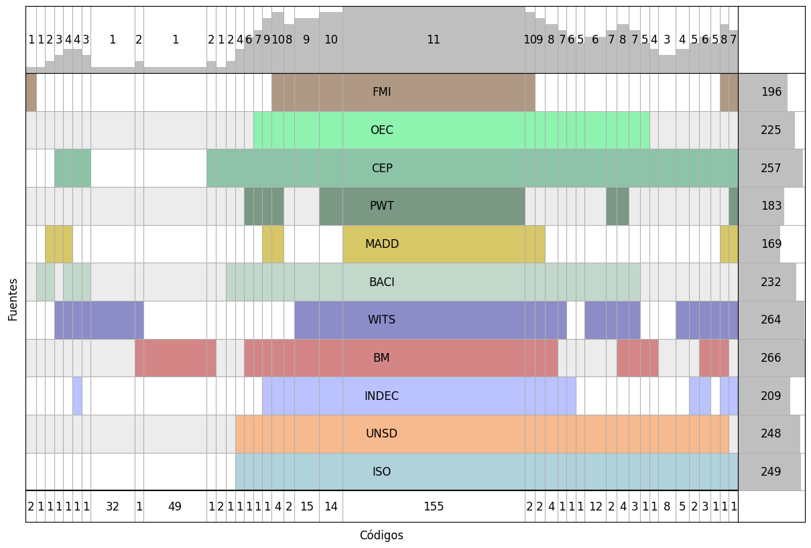

<a href="https://fund.ar">
  <picture>
    <source media="(prefers-color-scheme: dark)" srcset="https://github.com/user-attachments/assets/a3add638-f86c-452f-bb1d-5dbcc20893a2">
    <source media="(prefers-color-scheme: light)" srcset="https://github.com/user-attachments/assets/90703034-ef7f-4290-8a5d-2d27c6835fc7">
    </img>
  </picture>
</a>

El [geonomenclador](https://docs.google.com/spreadsheets/d/1744VS5xENUg1JRCaKr1dGUr73jgP-wz27guIhHvYGbQ) es esencialmente un diccionario que asigna códigos "estandar" a paises y regiones geográficas. Es una parte vital de ArgenData, pues es necesario para armonizar los datos provenientes de distintas bases.

## Tabla interactiva

Acceso a explorador del geonomenclador <https://argendatafundar.github.io/geonomencladores/geonomenclador_argendata.html>

<a href="https://fund.ar">
  <picture>
    <source media="(prefers-color-scheme: dark)" srcset="https://github.com/datos-Fundar/fundartools/assets/86327859/6ef27bf9-141f-4537-9d78-e16b80196959">
    <source media="(prefers-color-scheme: light)" srcset="https://github.com/datos-Fundar/fundartools/assets/86327859/aa8e7c72-4fad-403a-a8b9-739724b4c533">
    </img>
  </picture>
</a>

